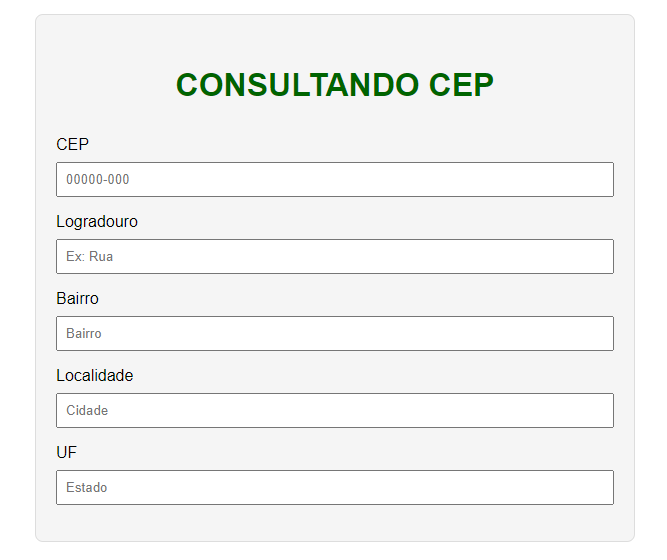
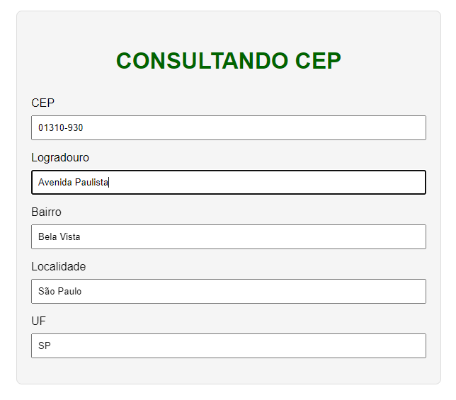

# Consulta CEP

Um simples aplicativo web para consultar informações de CEP.

## Logo

[

## Descrição

Este projeto consiste em uma página web que permite ao usuário consultar informações de CEP utilizando a API ViaCEP.

## Funcionalidades

- Consulta de informações de CEP.
- Preenchimento automático dos campos do formulário com base no CEP consultado.

## Como Usar

1. Abra o arquivo `index.html` no seu navegador.
2. Insira um CEP válido no campo correspondente.
3. Os campos do formulário serão preenchidos automaticamente com as informações do CEP consultado.

## Tecnologias Utilizadas

- HTML
- CSS
- JavaScript

## Estrutura do Projeto

- `index.html`: Página principal.
- `styles.css`: Estilos para a página.
- `main.js`: Lógica JavaScript para consulta e preenchimento do formulário.

## Autor

Desenvolvido por Diego Franco.

## Licença

Este projeto está licenciado sob a Licença MIT - consulte o arquivo [LICENSE.md](LICENSE.md) para obter detalhes.
